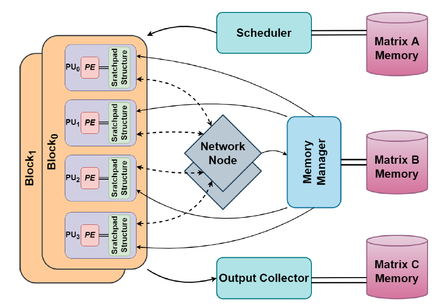

# Vivado HLS based SpGEMM Accelerator for small scale FPGAs (ZYNQ7020 SoC)

* Documentation can be found in 'SpGEMM_accelerator_report.pdf'.

* The "Baseline" version does not contain the interconnect (internals commented out)
  and sends all requests to the memory manager.

* The "exp" (experimental) version is the source code used to perform the experimental
  runs and produce results.

* "matGen.py" is used to generate the input and output data matrices.

* How to use:
	-- Run matGen.py and generate required data matrices of different
	   sizes and densities.
	-- Copy the 'matA' and 'matC' text files into the folders "baseline" and "exp".
	-- Set filestreams in the main function in testbench "system_top_test".
	-- Output metrics are dumped into the "metrics" text file.

